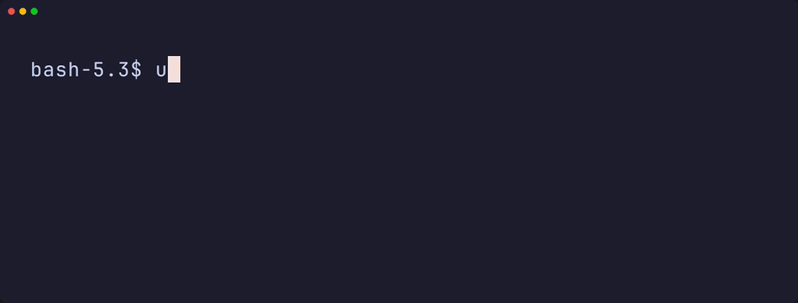

# undetected-httpx

**An HTTP probing toolkit inspired by <a href="https://github.com/projectdiscovery/httpx">httpx</a>, powered by curl_cffi with browser-grade TLS and HTTP fingerprinting.**

<table style="width: 100%; border-collapse: collapse; border: none;">
  <tr>
    <td align="center" style="border: none; width: 50%;">
      <b>undetected-httpx (Pro)</b> 
      
    </td>
    <td align="center" style="border: none; width: 50%;">
      <b>httpx (Original)</b> 
      
    </td> 
</tr>
</table>

`undetected-httpx` is a fast and flexible HTTP probing tool designed for modern web environments where traditional HTTP clients are easily fingerprinted or blocked.

By leveraging `curl_cffi` and `curl-impersonate`, it can mimic real browser TLS, JA3, and HTTP/2 fingerprints, making it suitable for reconnaissance, research, and large-scale HTTP probing.
